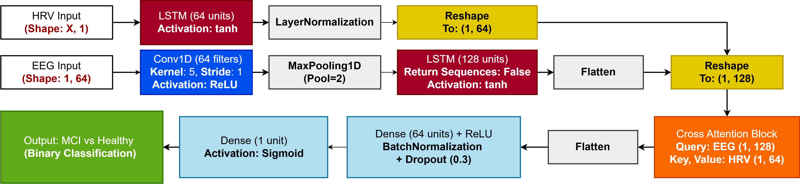

# 🧠 HyDL-MCI: Hybrid Deep Learning for EEG & HRV-Based MCI Detection

**Multimodal classification framework for early Mild Cognitive Impairment detection using EEG and HRV data, with attention-based fusion and CNN-LSTM architecture.**




---

## 📁 Contents
- `HyDL_SNCS.ipynb` — Training and evaluation on primary dataset  
- `HyDL_SNCS_validation.ipynb` — External validation on independent dataset  
- `data/` — Available on request  

---

## 🚀 Quick Start

```bash
git clone https://github.com/basmajalloul/HyDL-MCI.git
cd HyDL-MCI
pip install -r requirements.txt
```

Then open and run the notebook(s) in JupyterLab or VS Code:

- `HyDL_SNCS.ipynb` for training and evaluation  
- `HyDL_SNCS_validation.ipynb` for generalization testing

---

## 🧠 Method Overview

This framework fuses **EEG** and **HRV** data using a hybrid CNN-LSTM model with a multi-head cross-attention mechanism. It performs:

- Feature extraction via EMD (EEG) and statistical HRV descriptors  
- RFECV-based feature selection  
- Attention-driven fusion  
- 10-fold stratified cross-validation

---

## 📊 Results Summary

| Configuration        | Validation Accuracy | Macro F1-score |
|----------------------|---------------------|----------------|
| EEG Only (HyDL)      | 76.50%              | 0.83           |
| HRV Only (HyDL)      | 64.09%              | 0.66           |
| EEG + HRV (HyDL)     | **91.59%**          | **0.94**       |

> Results from primary dataset. See `HyDL_SNCS_validation.ipynb` for cross-dataset generalization.

---

## 📬 Dataset Access

The datasets used in this study are not publicly available due to data-sharing restrictions. However, access may be granted upon reasonable request. Please contact the corresponding author:

```bash
📧 basma1707@gmail.com
```

---

## 📜 Citation

If you use this work in your research, please cite:

```
@article{jalloul2025hydl,
  title={Empirical Mode Decomposition and Attention-Driven Deep Fusion of Electroencephalographic and Heart Rate Variability for Cognitive Impairment Detection},
  author={Basma Jalloul and Siwar Chaabene and Bassem Bouaziz and Walid Mahdi},
  journal={Submitted, SN Computer Science},
  year={2025}
}
```

---

## 📄 License

MIT License